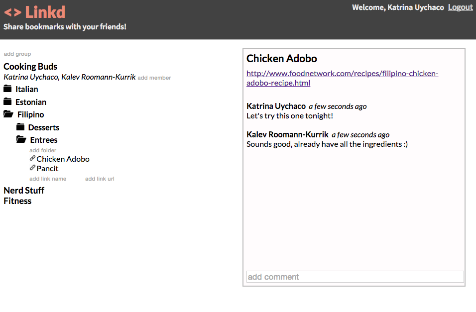
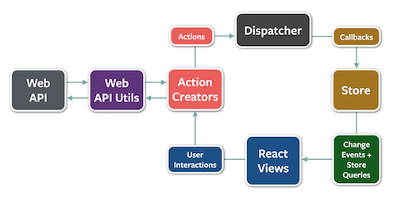

[](https://circleci.com/gh/PresentPath/Linkd)

# < > Linkd
_Share and discuss bookmarks with friends!_

Check it out: [linkd.herokuapp.com](https://linkd.herokuapp.com)

**Usage**

1. Log in using your google account
2. Create groups to share bookmarks with
3. Create folders to organize your links
4. Discuss links with friends!

**Table of Contents**

- [Screenshot](#screenshots)
- [Technologies](#technologies)
- [Interesting Aspect - Flux Refactor](#interesting-aspect)
- [Challenges](#challenges)
  - [Asynchronicity with Mocha Testing](#asynchronicity-with-mocha-testing) 
  - [React+Flux Rendering](#reactflux-rendering)


## Screenshot



## Technologies
**Server-side**

- Node.js - server-side JS runtime
- Express.js - server framework for Node.js 
- Mocha, Chai, Supertest - testing framework & libraries
- MySQL - relational database
- Sequelize - promise-based ORM
- Passport (Google strategy) - authentication middleware

**Client-side**

- React.js w/ JSX - view library
- Flux - application architecture
- Sass - CSS preprocessor

**Other**

- Webpack - module bundler
- CircleCI - continuous integration
- Heroku - hosting platform
- Bluebird - promise library

## Interesting Aspect
### To Flux or Not To Flux...
We took this project as an opportunity to learn React.js. The first implementation of the front end did not use Flux for two reasons: 

1. so that we could focus first on learning React.js
2. we weren't convinced Flux was necessary
3. lack of prescription allows room for interesting thought experiments and opportunities for gaining valuable context/insight 
	- how should we manage state to fit our needs?
	- what architecture makes sense to us? 

Since we had several sibling components that needed to have access to shared state, we decided to put all of our state on our topmost App component and have the state trickle down to child components using props. 

After getting a working version of our app, and plenty rounds of bug hunting/squashing, we were proud to have architected and built our first real React.js app. 

Yet things felt messy and there was this sort of visceral feeling of 'blegh' at how the state was being managed. It was time to bring in Flux. 

Did some research on Flux, now having more of a contextual understanding, and holy shit! The architecture is so clean and beautiful! 

- Clear separation of concerns between various constituents of your app:
	- views (strictly for rendering and handling user input, no logic)
	- dispatcher (manages data flow from input sources to stores)
	- action creators (declarative wrapper for the dispatcher)
	- stores (hold application state and logic)
	- web API utilities (handle server requests) 
- Single-directional data flow in such a way that is fairly straightforward and easy to reason about. Much better than the uni-directional flow we initially had from top to bottom of our React component tree.



- The dispatcher alone is a pretty sweet software construct, simple yet powerful - [see implementation](https://github.com/facebook/flux/blob/master/dist/Flux.js)

Even without the use of a Flux library, the refactor was pretty quick, straightforward, painless, and fun! Bugs that crept up along the way were easy to find and fix because the path was clear in terms of where to look.


## Challenges

### React+Flux Rendering

#### Problem:
Issue rendering a Group component after adding a new group. Error message indicated that the `folders` object for the added group was `undefined` at the time of rendering.

I wouldn't actually consider this issue too big of a challenge, thanks in large part to the fact that I had refactored the entire frontend to use the Flux application architecture. 

In fact, the real challenge took place prior to the refactor. Initially, since we had several sibling components that needed to have access to shared state, we decided to put all of our state and logic on our topmost App component and have the state trickle down to child components using props. There were tons of fun "Uncaught TypeError: Cannot read property X of undefined" or "Uncaught TypeError: undefined is not a function". The bug hunting process was a pain and the errors were mainly because the components would render before data was fully fetched from the server.

This particular bug was squashed in no time compared to previous bugs of a similar nature. Here's the approach I took and why it was so easy... 

#### Solution:

Be the interpreter... walked through the entire chain of operations:

GroupForm React View --> GroupAction Creator (createGroup) --> WebAPIUtils --> GroupAction Creator (receiveCreatedGroup & updateSelectedGroup) --> GroupStore --> Group React View

... realized very quickly that the GroupAction creator for receiving a newly created group was prematurely triggering a 'change' event.

Here's where the problem lied:  

```javascript
// WebAPIUtils.js
function createGroup (group) {
  $.post('/api/group/create', group)
    .done((response) => {
      var rawGroup = response[0];
      var rawFolder = response[1];
      GroupActions.receiveCreatedGroup(rawGroup); // Triggered unwanted change event
      GroupActions.updateSelectedGroup(rawGroup.id); // Triggered premature change event before root folder for group was added to store
      FolderActions.receiveCreatedFolder(rawFolder); // Signal to FolderStore to add root folder for new group
      FolderActions.updateSelectedFolderToRoot(rawGroup.id); // Sets display property so that views can be rendered appropriately
    })
    .fail((err) => {
      console.error('Error creating group', group.id, status, err.toString());
    });
}
```

Fixed the following two issues and things worked as expected:

1) Removed the change event emission in GroupActions.receiveCreatedGroup

2) Switched the order of these two actions:

```javascript
GroupActions.receiveCreatedGroup(rawGroup);
--> FolderActions.receiveCreatedFolder(rawFolder); // 
--> GroupActions.updateSelectedGroup(rawGroup.id);
FolderActions.updateSelectedFolderToRoot(rawGroup.id);
```

GroupActions.updateSelectedGroup was emitting a change event, prematurely triggering a re-render before FolderActions.receiveCreatedFolder triggered the addition of the root folder to FolderStore.


### Asynchronicity with Mocha Testing
#### Problem:
Asynchronous running of test spec files - During database testing, test spec files for the different models were being run asynchronously resulting in jumbled results output to the console. Also, the tests were being run before the database schema was fully loaded, resulting in a "Table doesn't exist" error. 

##### Jumbled test output:


We have two separate problems here:
1) Spec files being run asynchronously. 
2) Tests running before database is set up.

#### Solution:
1) This may not be the most elegant solution, but it's one that makes sense to me and allows me to have some fun with Promises. Surprisingly, Google searching didn't yield much, so just went with this implementation:

##### Exported spec files
Invoked callback in last test to resolve promise.
```javascript

module.exports = function(CALLBACK) {
  // User Controller
  describe('----- User Router/Controller tests -----', function() {
    
    it('should do stuff', function(done) { /* stuff */ });
    it('should do other stuff', function(done) { /* other stuff */ });
    it('should retrieve users from the database', function(done) {

        request(app)
          .get('/api/user/list')
          .end(function(err, res) {
            if (err) {
              CALLBACK(err);
              return done(err);
            }
            // assertions
            CALLBACK();
            done();
          });

    });
  });

};

```

##### Master spec file
Created promise chain to run tests synchronously.
```javascript

var userSpec = Promise.promisify(require('../User/userSpec.js'));
var groupSpec = Promise.promisify(require('../Group/groupSpec.js'));
var folderSpec = Promise.promisify(require('../Folder/folderSpec.js'));
var linkSpec = Promise.promisify(require('../Link/linkSpec.js'));
var commentSpec = Promise.promisify(require('../Comment/commentSpec.js'));

describe('database controller tests', function() {

  userSpec()
  .then(function() {
    return groupSpec();
  })
  .then(function() {
    return folderSpec();
  })
  .then(function() {
    return linkSpec();
  })
  .then(function() {
    return commentSpec();
  })
  .catch(function(err) {
    console.error('Error testing database controllers:', err);
  });

});
```


